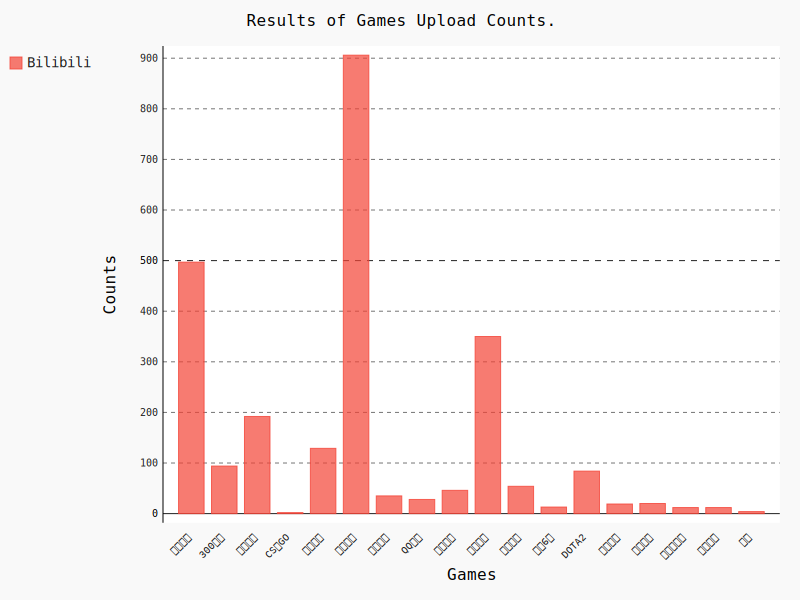

<h2>对 bilibili 竞技游戏区块，上传稿件信息的抓取</h2> 

使用 Scrapy 框架进行爬取，代理选择的讯代理。其中添加 SeleniumMiddleWare,实现对竞技游戏首页的爬取。 
再使用 VideoMiddleWare 对各个视频信息进行内容的爬取。 

添加了 TextPipeLine 对 Item 进行处理。 
之后由 MongoPipeLine 将 Item 存储
 

最后使用 pygal 生成数据图
 

其结果如下图所示
</br。

